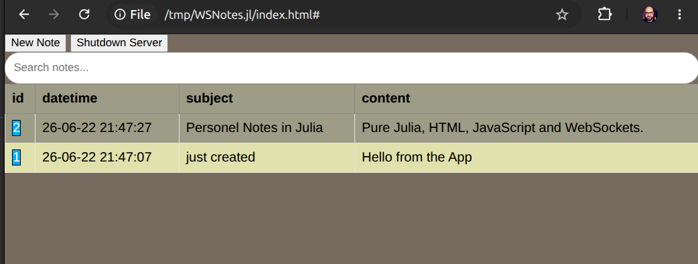
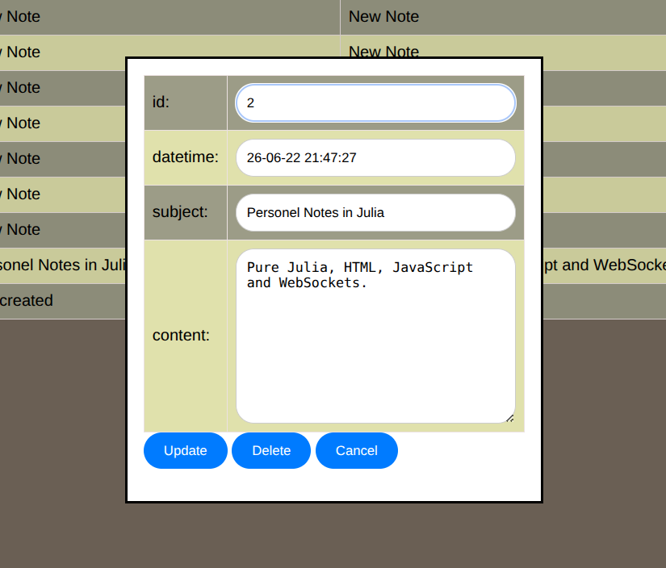

# WSNotes.jl
Personal Notes App with WebSockets in Julia


# Why?

I was looking for the best UI tool for Julia. 
HTTP.jl and WebSockets look like the best light-weight tool 
for communicating Julia and browser. This is my proof-of-concept app to get things together. 

# How to run? 

Clone the repo:

```shell
git clone https://github.com/jbytecode/WSNotes.jl.git
```

and then start Julia in the project folder:

```shell
# julia --project=. 
```

In Julia, type:

```julia
julia> using WSNotes
[ Info: WSNotes.jl module loaded. Use WSNotes.run() to start the WebSocket server.

julia> WSNotes.run()
[ Info: Creating database connection to notes.db...
[ Info: WebSocket server running on localhost:8000, using database at notes.db
[ Info: Open the index.html file in the browser to connect to the server and start taking notes.
[ Info: Shutdown message received. Closing WebSocket connection and shutting down the server...
```

then double click the index.html file in the project folder to open it using Chrome.



